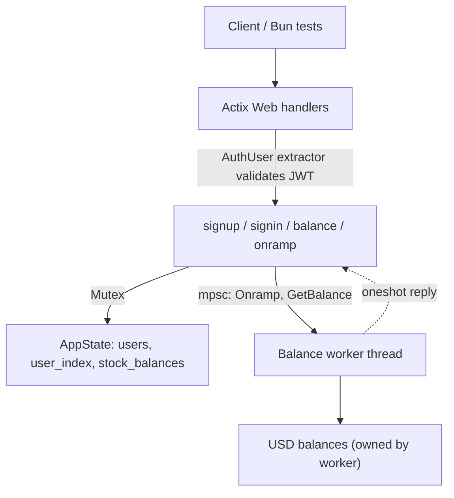

# cex-rust — a centralized exchange backend, built to learn

A centralized cryptocurrency exchange (CEX) backend in **Rust** and **Actix Web**. The exchange holds user funds, authenticates users, and (eventually) matches their buy and sell orders itself, unlike a DEX, where swaps settle on-chain.

This is a learning project. I'm building it in small, tested steps to understand how exchange backends handle identity, balances, concurrency, and eventually order matching. **It is not safe for real funds.** See [Known issues](#known-issues).

> A parallel TypeScript implementation lives in [`../cex-ts`](../cex-ts) so I can compare how the two runtimes handle the same problem.

---

## Status at a glance

| Endpoint | Auth | Status | Notes |
| --- | --- | --- | --- |
| `POST /signup` | none | Working | Duplicate usernames rejected |
| `POST /signin` | none | Working | Returns a 24h JWT |
| `GET /balance` | JWT | Working | USD from the balance worker, stocks from shared state |
| `POST /onramp` | JWT | Working | Fire-and-forget message to the balance worker |
| `POST /deposit/...` | JWT | **Written, not wired up** | Handler exists but is not registered in `main.rs`; see [Known issues](#known-issues) |
| `POST /order`, `POST /cancel` | JWT | Not started | Stubbed as comments; needs an order book |

---

## Tech stack

| Tool | Why |
| --- | --- |
| Rust (edition 2024) | Ownership and type system make shared-state bugs visible at compile time |
| Actix Web 4 | HTTP server; requests are handled concurrently on a thread pool |
| Serde / serde_json | Request and response (de)serialization; `camelCase` for API output |
| jsonwebtoken + chrono | Signing JWTs and computing expiry |
| `std::sync::Mutex` | Guarding shared in-memory state |
| `std::sync::mpsc` + `futures::channel::oneshot` | Message passing to the balance worker and getting replies back |
| Bun + Axios | Integration tests against the running server over real HTTP |

---

## Architecture



Code layout:

```
src/
  main.rs              AppState, BalanceMessage enum, worker thread, server setup
  middleware.rs        AuthUser extractor (JWT validation), AuthError
  routes/user.rs       signup, signin, balance, onramp, deposit handlers
  types/user.rs        User, request/response structs, JWT Claims
```

---

## Engineering logic so far

### 1. Two ways of owning state, on purpose

The project currently uses both common approaches to shared state, which makes the trade-off easy to see:

- **Lock-based (`Mutex`)**: `users`, `user_index`, and `stock_balances` live in `AppState` behind mutexes. Any handler can lock and mutate them. Simple, but correctness depends on every caller locking correctly.
- **Actor-style (message passing)**: USD balances are owned by a single worker thread. Handlers can't touch the map. They send a message (`Onramp` or `GetBalance`) and the worker applies it.

```rust
enum BalanceMessage {
    Onramp(u32, u32),                                  // user_id, amount
    GetBalance(u32, oneshot::Sender<u32>),             // user_id, reply channel
}
```

The worker processes messages one at a time, so there are no data races on the USD map. Updates are serialized without any lock around the balance logic.

### 2. Request/response over a one-way channel

`mpsc` only flows one direction. To read a balance, the handler creates a `oneshot` channel, sends its `Sender` inside the message, and `await`s the `Receiver`:

```rust
let (tx, rx) = oneshot::channel::<u32>();
app_state.balances_tx.send(BalanceMessage::GetBalance(user_id, tx));
let usd_balance = rx.await.unwrap();
```

Because the worker is single-threaded and the channel is FIFO, an `Onramp` sent before a `GetBalance` is always applied before it. So a client that calls `/onramp` and then `/balance` sees its own write, even though `/onramp` returns without waiting for the worker.

### 3. Authentication as an extractor

`AuthUser` implements Actix's `FromRequest`. Any handler that declares `user: AuthUser` as a parameter is automatically protected: the extractor reads `Authorization: Bearer <token>`, decodes the JWT, and yields the user ID from the `sub` claim. If validation fails, the handler never runs.

Two consequences I like:
- The user identity **always comes from the token**, never from the URL or body, so a client can't act as another user by changing a parameter.
- Auth is declared in the handler signature, so it can't be forgotten by omission in a router config.

(The file is named `middleware.rs`, but it's an extractor, not middleware, so it only runs where a handler asks for it.)

### 4. Money as integers

Balances and quantities are integers (`u32`), never floats, to avoid rounding errors. The plan is to move to a wider type and define explicit units (for example, cents for USD, smallest units for assets).

### 5. Initialization on signup

`/signup` sends `Onramp(id, 0)` to the worker and inserts an empty asset map, so every user has an entry in both stores from creation.

---

## Known issues

Found while reviewing the code, roughly in priority order.

**Correctness**

1. **`/deposit` doesn't work yet.** It is not imported or registered in `main.rs`. Its route is `/deposit/{asset_symbol}/{user_id}` but the handler extracts a single `Path<String>`, so extraction fails with two path segments. The `{user_id}` segment should be dropped, since identity comes from the JWT. That matches the design and the API shape I documented.
2. **Overflow can kill the worker.** `amount + existing_amount` on `u32` panics in debug builds and wraps silently in release. If the worker thread panics, every later `GetBalance` fails and `rx.await.unwrap()` panics in the handler. Fix: `checked_add`, a wider type, and returning an error instead of unwrapping.
3. **Onramp is fire-and-forget.** The handler returns `200` without confirmation, and send errors are ignored (`let _ =`). If the worker is gone, the client is told it succeeded.
4. **Two sources of truth for balances.** USD lives in the worker and assets live in a mutex map. That works for independent deposits, but a trade must change both atomically (debit USD, credit BTC, and the reverse), which two separate stores can't guarantee.

**Security** (must be fixed before anything real)

5. Passwords are stored and compared in plaintext. Use `argon2` or `bcrypt`.
6. The JWT secret is hardcoded in two places (`"secret"`), and the `JWT_SECRET` constant in `middleware.rs` is unused. Load one secret from the environment.
7. The `Bearer ` prefix is optional (`trim_start_matches`), so a bare token is accepted.

**API quality**

8. Status codes: duplicate signup returns `401` (should be `409`); a missing or invalid token returns `400` (should be `401`).
9. `println!("Hi from middleware 1")` is leftover debug output.
10. `users` is a `Vec` searched linearly. A `HashMap` keyed by username would be O(1).
11. Asset symbols are case-sensitive (`BTC` and `btc` are different assets). Normalize them.
12. Cargo.toml lists a crate named `web`, which looks like an accidental auto-import. Remove it unless intentional.

---

## Design direction: one engine thread

The balance worker is the seed of the matching engine. The matching engine needs to change USD balances, asset balances, and the order book together, and a single owning thread gives that atomicity without locks. The plan:

```rust
enum EngineMessage {
    Onramp { user_id, amount },
    Deposit { user_id, asset, qty },
    GetBalances { user_id, reply },
    PlaceOrder { user_id, order, reply },
    CancelOrder { user_id, order_id, reply },
}
```

The engine owns balances and the order book, applies each message to completion, and replies over a `oneshot`. Handlers stay thin: validate, send, await. This also gives a deterministic ordering of events that is easy to test and later to persist or replay.

---

## Roadmap

**Phase 1: core backend**
- [x] Actix server, signup/signin, JWT
- [x] Protected `/balance`, message-driven USD worker, `/onramp`
- [x] Integration tests with Bun + Axios
- [ ] Register and fix `/deposit/{asset_symbol}`, with tests
- [ ] Consistent error types and status codes

**Phase 2: trading engine**
- [ ] Order types and `POST /order`, `POST /cancel`
- [ ] In-memory order book with price-time priority (FIFO within a price level)
- [ ] Matching, partial fills, balance updates after trades

**Phase 3: financial correctness**
- [ ] Reject overspending and negative balances
- [ ] Lock funds when an order is placed and release them on cancel or fill
- [ ] Merge USD and asset balances under the single engine
- [ ] Trade and transaction history; idempotent operations

**Phase 4: production concerns**
- [ ] Password hashing, env-based secrets, request validation
- [ ] PostgreSQL for users, orders, and trades
- [ ] Logging, load and failure-recovery tests, Docker, CI

---

## What I've learned so far

| Concept | Where it shows up |
| --- | --- |
| Ownership and borrowing | Moving the `HashMap` into the worker thread so only it can touch it |
| Enums and pattern matching | `BalanceMessage` and the worker's `match` loop |
| `Mutex` and lock scope | Guards in `signup` and `deposit`; keep critical sections short and don't hold them across `.await` |
| `mpsc` vs `oneshot` | Many handlers to one worker, and a private reply channel per request |
| Extractors | `AuthUser` as declarative, per-handler authentication |
| Trade-offs of actors vs locks | Both are present, and the split-brain problem in issue 4 motivates the single-engine design |
| Integration testing | Testing through real HTTP instead of calling functions |

---

## Running locally

Requires Rust/Cargo, plus [Bun](https://bun.sh) for the tests.

```bash
cd cex-rust
cargo run                                   # serves on http://127.0.0.1:3001
```

In a second terminal:

```bash
export RUST_BACKEND_URL=http://127.0.0.1:3001     # PowerShell: $env:RUST_BACKEND_URL="http://127.0.0.1:3001"
bun test
```

Quick manual check:

```bash
curl -X POST localhost:3001/signup -H 'Content-Type: application/json' -d '{"username":"amit","password":"123123"}'
TOKEN=$(curl -s -X POST localhost:3001/signin -H 'Content-Type: application/json' -d '{"username":"amit","password":"123123"}' | jq -r .token)
curl -X POST localhost:3001/onramp -H "Authorization: Bearer $TOKEN" -H 'Content-Type: application/json' -d '{"qty":100}'
curl localhost:3001/balance -H "Authorization: Bearer $TOKEN"
```

Everything is in memory, so all users and balances reset when the server restarts.